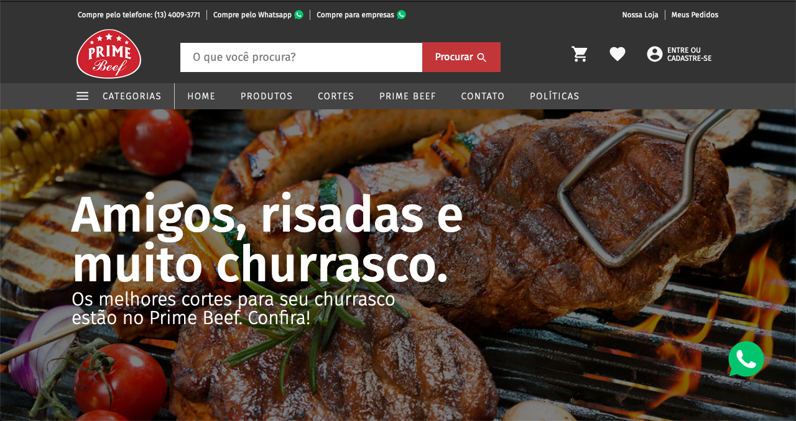
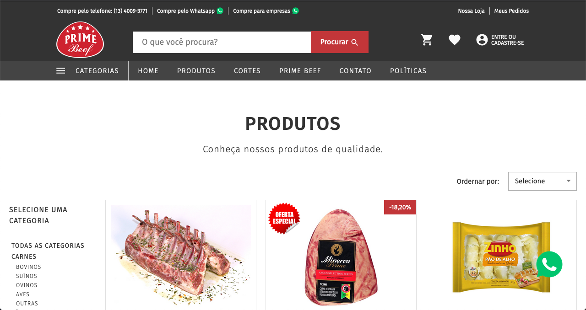
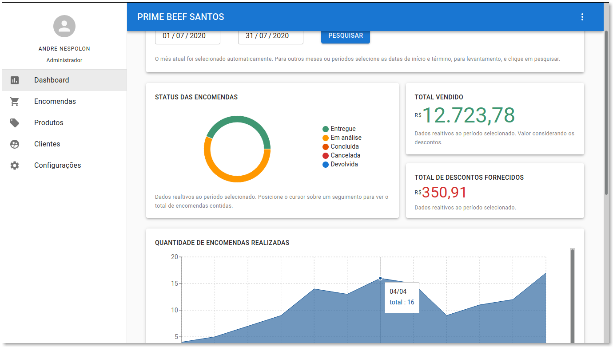
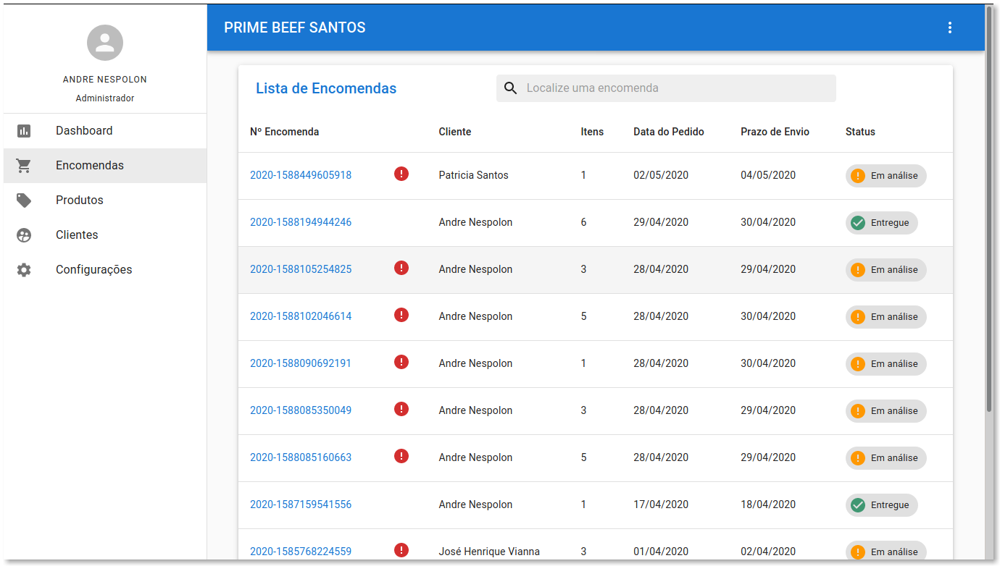

# primebeef
A simple ordering website. 🍖  
Prime Beef is a simple private prototype ordering website, using React, Router, Redux, Styled Components. It consumes a Node API and MongoDB database.  
You can see it [here](https://www.primebeefsantos.com.br/).

---

## Shop

---

## WebApp

